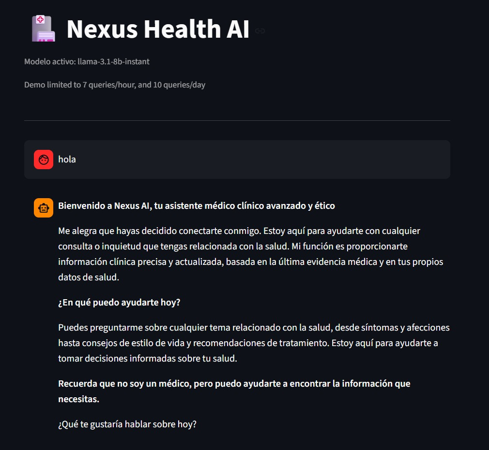
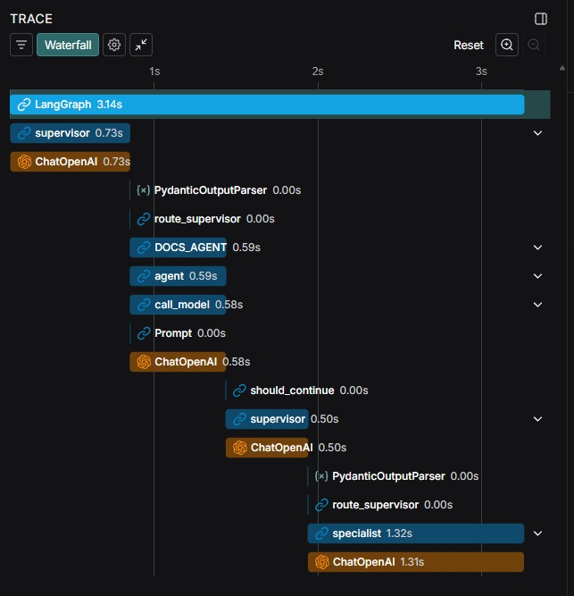
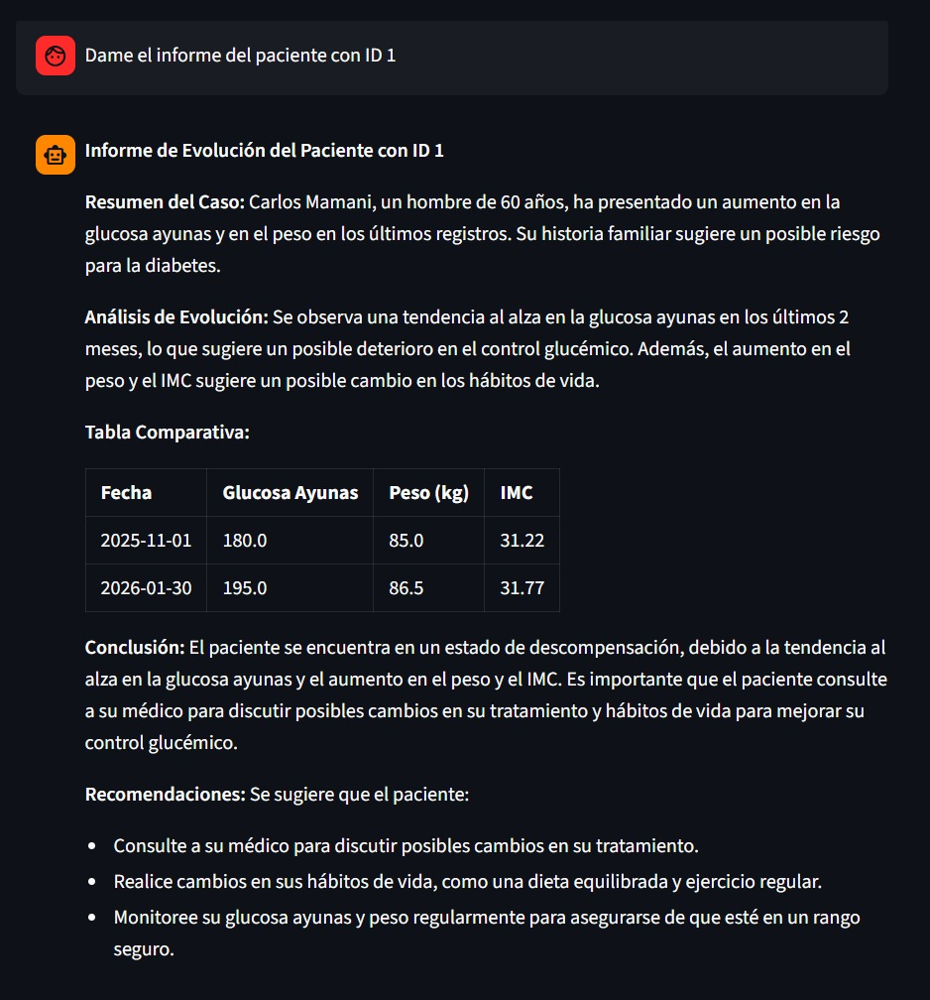
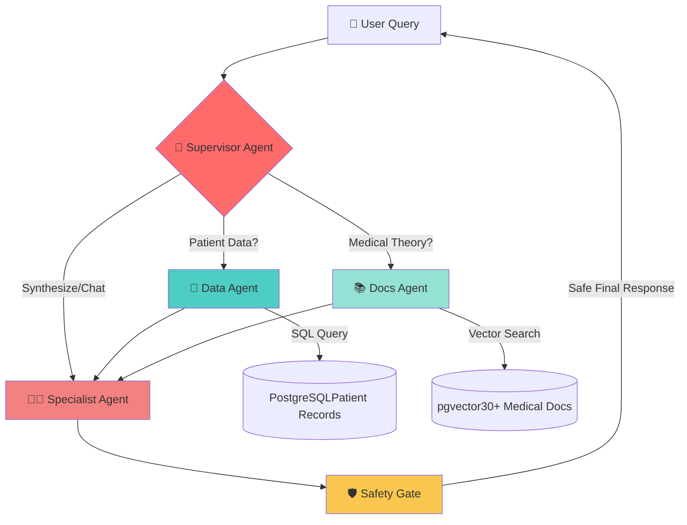
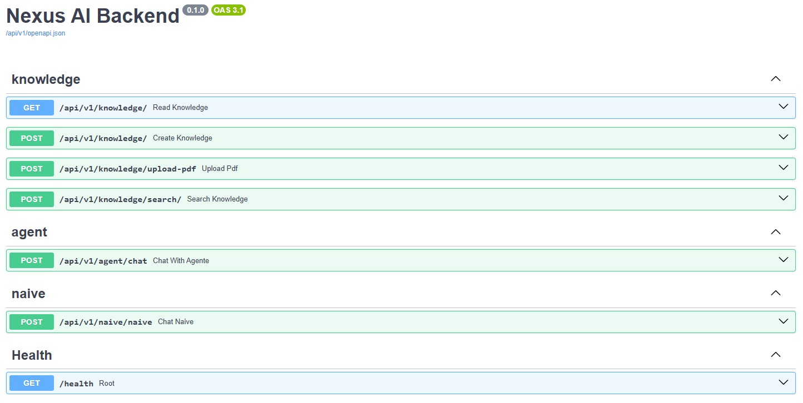
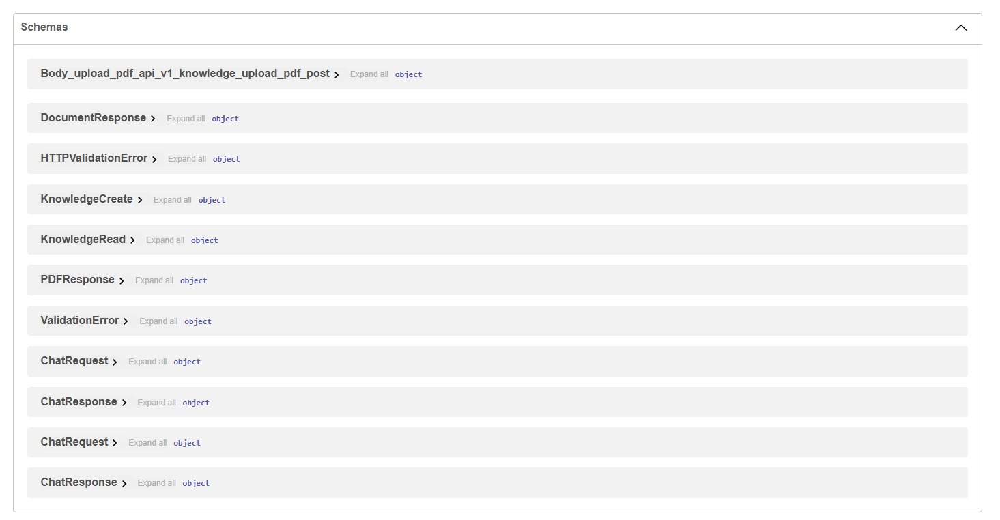

# 🏥 Nexus Health AI: Clinical Multi-Agent System

[](https://www.python.org/)
[](https://fastapi.tiangolo.com/)
[](https://streamlit.io/)
[](https://langchain-ai.github.io/langgraph/)
[](https://www.docker.com/)

> **Thesis Project:** An advanced autonomous multi-agent system designed to assist healthcare professionals by synthesizing patient clinical records (SQL) with medical literature (RAG) in real-time.

## 🚀 Live Demo

**Try it now:**
- 🎨 **Frontend:** [nexus-healthcare.streamlit.app](https://nexus-healthcare.streamlit.app/)

It might be in sleep mode due to the free trial levels.

---

## 🎬 See It In Action

### Simple Query - Medical Guidelines

*chat start greeting*

<details>
<summary>🔍 View Agent Trace</summary>


*LangSmith trace showing*
</details>

---

### Complex Query - Patient Analysis + Guidelines

*Retrives patient information, analyzes it, and finally specialist agent synthesizes the final response.*

<details>
<summary>🔍 View Multi-Agent Orchestration</summary>


*Supervisor coordinates*
</details>

---

---

## 🧠 The Problem

Traditional LLMs face critical challenges in healthcare:
- ❌ **Hallucinations:** Generate plausible but incorrect medical information
- ❌ **No Private Data Access:** Cannot query patient databases
- ❌ **Context Blindness:** Simple RAG lacks clinical reasoning

**Nexus Health AI solves this** with specialized agents that:
1. 🏥 **Query** private patient databases (SQL)
2. 📚 **Research** medical literature (RAG with 30+ documents)
3. 🧠 **Reason** across both sources for evidence-based insights

---

## 🏗️ System Architecture

The system uses a **Supervisor-Worker** pattern implemented with **LangGraph**. A central LLM router decides which tool to use based on the user's intent.


```mermaid
graph TD
    User[👤 User Query] --> Supervisor{🎯 Supervisor Agent}
    
    Supervisor -->|"Patient Data?"| DataAgent[🏥 Data Agent]
    Supervisor -->|"Medical Theory?"| DocsAgent[📚 Docs Agent]
    Supervisor -->|"Synthesize/Chat"| Specialist[👨‍⚕️ Specialist Agent]
    
    DataAgent -->|SQL Query| DB[(PostgreSQLPatient Records)]
    DocsAgent -->|Vector Search| VectorDB[(pgvector30+ Medical Docs)]
    
    DataAgent --> Specialist
    DocsAgent --> Specialist
    
    Specialist --> SafetyGate[🛡️ Safety Gate]
    SafetyGate -->|Safe Final Response| User
    
    style Supervisor fill:#FF6B6B
    style DataAgent fill:#4ECDC4
    style DocsAgent fill:#95E1D3
    style Specialist fill:#F38181
    style SafetyGate fill:#F9C74F
```

🤖 Agent Roles
| Agent | Model | Function | Tools |
|-------|-------|----------|-------|
| Supervisor | Llama 3.1 8B | Orchestrator/Router | JSON State Parsing |
| Data Agent | Llama 3.1 8B | SQL Analyst | lookup_patient_history |
| Docs Agent | Llama 3.1 8B | Medical Researcher | search_medical_guidelines |
| Specialist | Llama 3.1 8B | Clinical Synthesizer | Context Integration |

---

## 🚀 Key Features

### 🔄 Hybrid Information Retrieval
Seamlessly combines:
- **Structured data:** SQL queries on patient records
- **Unstructured knowledge:** Vector search on medical literature

### 🛡️ Production-Ready
- **Rate limiting:** Token bucket algorithm (slowapi)
- **CORS configured:** Secure cross-origin requests
- **Dockerized:** Reproducible deployments
- **CPU-optimized:** ONNX Runtime for fast embeddings

### 📊 Observable & Debuggable
- LangSmith integration for trace visualization
- Comprehensive logging
- Health check endpoints

---

## 🛠️ Tech Stack

<table>
<tr>
<td width="50%">

**Backend**
- Python 3.12
- FastAPI (async API)
- LangChain + LangGraph
- PostgreSQL + pgvector
- SQLModel (ORM)

</td>
<td width="50%">

**AI/ML**
- Groq API (Llama 3.1 8B)
- intfloat/multilingual-e5-large
- FlashRank (reranking)
- LangSmith (observability)

</td>
</tr>
<tr>
<td>

**Frontend**
- Streamlit
- Python requests

</td>
<td>

**Infrastructure**
- Docker + Docker Compose
- HuggingFace Spaces
- Supabase (Database)

</td>
</tr>
</table>

---

## 📖 API Documentation

### Interactive Swagger UI

*Auto-generated FastAPI documentation*

### Data Models

*Pydantic schemas for request/response validation*

### Safety Gate (diabetes/prediabetes)
- Guia operativa: [docs/safety-gate-v1.md](docs/safety-gate-v1.md)
- Runbook (config, monitoreo, rollout/rollback): [docs/safety-gate-runbook.md](docs/safety-gate-runbook.md)

---

## ⚡ Quick Start

### Prerequisites
- Docker & Docker Compose
- [uv](https://github.com/astral-sh/uv) (Python package manager)

### 1️⃣ Clone Repository
```bash
git clone https://github.com/JosuePerezValenzuela/Nexus.git
cd Nexus
```

### 2️⃣ Environment Variables
Create `.env` file:
```env
POSTGRES_SERVER=
POSTGRES_PORT=
POSTGRES_USER=
POSTGRES_PASSWORD=
POSTGRES_DB=

LLM_HOST=
VLLM_API_KEY=
LLM_MODEL_NAME=

environment=

# Safety gate (diabetes/prediabetes)
SAFETY_GATE_ENABLED=false
SAFETY_GATE_STRICT_MODE=true
SAFETY_GATE_MAX_REASON_CODES=5
SAFETY_GATE_EXPOSE_METADATA=false
```

### Safety gate quickstart

- Habilitar: setea `SAFETY_GATE_ENABLED=true` y reinicia el backend.
- Deshabilitar: setea `SAFETY_GATE_ENABLED=false` y reinicia el backend.
- Verificacion rapida: revisa logs de `safety_gate_decision` y counters de safety gate.

### 3️⃣ Start Services
```bash
docker compose up --build
```

### 4️⃣ Access
- **Frontend:** http://localhost:8501 (uv run streamlit run frontend/app.py)
- **Backend API:** http://localhost:8000 (uv run dev)
- **API Docs:** http://localhost:8000/docs

## 🧪 Example Scenarios

### 1. Patient Analysis (Data Agent)
**Query:** *"Give me a report on patient ID 1"*

**What happens:**
1. Supervisor routes to **Data Agent**
2. Data Agent queries PostgreSQL
3. Specialist synthesizes clinical summary

**Result:** Complete patient profile with glucose trends, weight evolution, and risk assessment.

---

### 2. Medical Research (Docs Agent)
**Query:** *"What is the recommended treatment for prediabetes?"*

**What happens:**
1. Supervisor routes to **Docs Agent**
2. Docs Agent searches 30+ medical PDFs (WHO, ADA, PAHO)
3. Specialist formats evidence-based recommendations

**Result:** Treatment guidelines with source citations.

---

### 3. Complex Clinical Reasoning (Multi-Agent)
**Query:** *"Is patient Carlos Mamani (ID 1) following treatment targets?"*

**What happens:**
1. Supervisor routes to **both agents**
2. Data Agent: Fetches Carlos's latest glucose (195 mg/dL)
3. Docs Agent: Retrieves target range guidelines (<100 mg/dL fasting)
4. Specialist: Synthesizes comparison with clinical recommendations

**Result:** Personalized assessment with actionable insights.

---

📂 Project Structure
```Plaintext
nexus-health/
├── src/app/
│   ├── graph/            # LangGraph Nodes, Workflows and Tools
│   ├── api/              # FastAPI Endpoints
│   ├── core/             # Config, Security & Prompts
│   ├── db/               # Seeders
│   ├── models/           # SQLModel
│   ├── schemas/          # DTO's
│   └── services/         # Services
├── frontend/             # Streamlit Application
├── Dockerfile            # Backend Image
└── docker-compose.yml    # Orchestration
```

---

## 🎓 Learning Outcomes

This project demonstrates:
- ✅ Multi-agent orchestration with LangGraph
- ✅ Hybrid RAG architecture (SQL + Vector DB)
- ✅ Production LLM system design
- ✅ Clean architecture patterns in Python
- ✅ Docker microservices deployment
- ✅ LLM observability & debugging

---

## 📄 License

This project is licensed under the MIT License - see [LICENSE](LICENSE.txt) file for details.

---

## 👨‍💻 Author

**Josue Jonathan Perez Valenzuela**

- 🔗 LinkedIn: [linkedin.com/in/josueperez](https://www.linkedin.com/in/josue-perez-valenzuela-bolivia/)
- 💼 GitHub: [@JosuePerezValenzuela](https://github.com/JosuePerezValenzuela)
- 📧 Email: josueperezv2004@gmail.com

---

<div align="center">

**⭐ Star this repo if you find it useful!**

Built with ❤️ for healthcare innovation

</div>
