# 🏥 Nexus Health AI: Clinical Multi-Agent System

[](https://www.python.org/)
[](https://fastapi.tiangolo.com/)
[](https://streamlit.io/)
[](https://langchain-ai.github.io/langgraph/)
[](https://www.docker.com/)

> **Thesis Project:** An advanced autonomous multi-agent system designed to assist healthcare professionals by synthesizing patient clinical records (SQL) with medical literature (RAG) in real-time.

🔗 **Live Demo:** [...]

---

## 🧠 The Problem
Traditional LLMs suffer from "Hallucinations" and lack access to private patient data. Simple RAG systems lack clinical context. 
**Nexus Health** solves this by orchestrating specialized agents that can:
1.  **Read** private SQL databases (Patient Records).
2.  **Research** medical guidelines (PDFs/RAG).
3.  **Reason** across both sources to provide evidence-based clinical insights.

---

## 🏗️ System Architecture

The system uses a **Supervisor-Worker** pattern implemented with **LangGraph**. A central LLM router decides which tool to use based on the user's intent.

```mermaid
graph TD
    User[User Query] --> Supervisor{Supervisor Agent}
    
    Supervisor -->|Needs History| DataAgent[🏥 Data Agent]
    Supervisor -->|Needs Theory| DocsAgent[📚 Docs Agent]
    Supervisor -->|Chat/Done| Specialist[👨‍⚕️ Specialist Agent]
    
    DataAgent -->|SQL Query| DB[(PostgreSQL)]
    DocsAgent -->|Vector Search| VectorDB[(PGVector / FAISS)]
    
    DataAgent --> Specialist
    DocsAgent --> Specialist
    
    Specialist -->|Final Synthesis| User
```



🤖 Agent Roles
| Agent | Model | Function | Tools |
|-------|-------|----------|-------|
| Supervisor | Llama 3.1 8B | Orchestrator/Router | JSON State Parsing |
| Data Agent | Llama 3.1 8B | SQL Analyst | lookup_patient_history |
| Docs Agent | Llama 3.1 8B | Medical Researcher | search_medical_guidelines |
| Specialist | Llama 3.1 8B | Clinical Synthesizer | Context Integration |

🚀 Key Features

* Hybrid Information Retrieval: Seamlessly combines structured data (SQL) with unstructured knowledge (Vector Store).
* Stateful Memory: Remembers conversation context across multiple interactions (using persistent checkpointers).
* Self-Correction: Agents can retry queries if they fail or hallucinate.
* Rate Limiting: Protected against abuse with slowapi (Token Bucket algorithm).
* Production Ready: * Dockerized Microservices (Frontend/Backend separated).
* Optimized for CPU inference (ONNX Runtime for Embeddings).

🛠️ Tech Stack
* Core: Python 3.12, LangChain, LangGraph.
* API: FastAPI, Pydantic, SlowAPI.
* Database: PostgreSQL + pgvector (Vector Search).
* RAG Pipeline:
    * Embeddings: intfloat/multilingual-e5-large (HuggingFace).
    * Reranker: FlashRank (Local optimization).
* Frontend: Streamlit (Server-Side Rendering).
* Infrastructure: Docker Compose, Railway.

⚡ Quick Start (Local)
Prerequisites: Docker and uv.

1. Clone the repository
```bash
git clone https://github.com/JosuePerezValenzuela/Nexus.git
cd nexus-health
```

2. Environment Variables Create a `env` file in the root:
```env
POSTGRES_SERVER=
POSTGRES_PORT=
POSTGRES_USER=
POSTGRES_PASSWORD=
POSTGRES_DB=

HF_TOKEN=

LLM_HOST=
VLLM_API_KEY=
LLM_MODEL_NAME=

environment=
```

3. Run with Docker
```bash
docker-compose up --build
```

4. Access the App
  * Frontend: http://localhost:8501
  * Backend API: http://localhost:8000/docs

🧪 Example Scenarios
1. Patient Analysis (Data Agent)

"Give me a report on patient ID 2"

  * Result: Retrieves Juana's glucose levels, weight history, and calculates trend evolution.

2. Medical Research (Docs Agent)

"What is the recommended treatment for prediabetes according to the guidelines?"

  * Result: Retrieves generic treatment protocols from the ADA/WHO PDFs.

3. Complex Clinical Reasoning (Multi-Agent)

"Considering Juana's current glucose levels (ID 2), is she following the recommended targets?"

  * Result: 1. Fetches Juana's glucose (115 mg/dL). 2. Fetches Guidelines (Target < 100 mg/dL). 3. Synthesizes: "Juana is slightly above the target range..."

📂 Project Structure
```Plaintext
nexus-health/
├── src/app/
│   ├── graph/            # LangGraph Nodes, Workflows and Tools
│   ├── api/              # FastAPI Endpoints
│   ├── core/             # Config, Security & Prompts
│   ├── models/           # SQLModel
│   ├── schemas/          # DTO's
│   └── services/         # Services
├── frontend/             # Streamlit Application
├── Dockerfile            # Backend Image
├── Dockerfile.frontend   # Frontend Image
└── docker-compose.yml    # Orchestration
```

📝 License
This project is licensed under the MIT License.